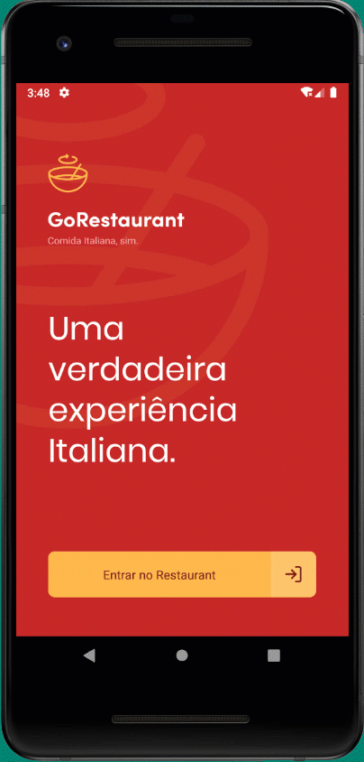

# React Native - GoRestaurant

Exercise on ReactJS for the Bootcamp GoStack - Rocketseat.

List dishes and make orders.

This project uses a fake API (json file) to provide the data.


### Installation

To install all dependencies:

```
yarn
```


To run the back-end:

```
yarn json-server server.json -p 3333
```

To configure the Android emulator network:
```
adb reverse tcp:3333 tcp:3333
```

To run the project:

```
yarn android
```


<br/><br/>

